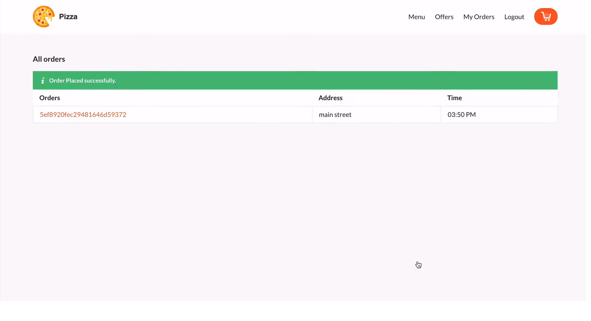

# Pizza-App_expressJS_mongoDB

A realtime online pizza order app using Node Js, Express Js and Mongo DB. Using tailwind css for frontend as a css framework and used EJS template engine as well. Socket.io was used for realtime communications.

Project features are:
- Login System
- Cookies and Session (Database used as a session store)
- Registration
- User role (Admin, Customer)
- Shopping Cart
- Realtime Pizza status tracker(using socket.io)

### some screenshots of the project

> Home page to order pizza

> Login & Registration 

> An empty cart

> In cart section we can see the added pizzas before order.

> After order the added pizzas realtime status has been shown

> Realtime status can be checked of teh ordered items

> From the Admin panel, pizza Admin can see the confirmed orders

> He can change the status of the orders items

> pizza admin update the status and the customer can see the notifications instatnly.

